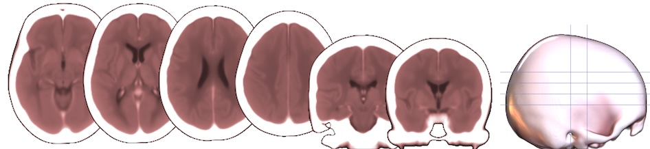

## About

This repository provides tools for converting CT scans in DICOM format to NIfTI using BIDS organization. The goal is to aid scientific and medical discovery from these data. While the DICOM standard is dominant for medical imaging, it is complex and pragmatically few neuroimaging tools support it. In contrast, the NIfTI format is simple and the Brain Imaging Data Structure (BIDS) provides allows automated and reproducible analyses.

### Caveats

This script uses emerging methods, so users will need to be aware of a few potential issues:

 - The BIDS Computed Tomography specification has not yet been finalized. This repository will adapt as the [BEP 024](https://bids.neuroimaging.io/extensions/beps/bep_024.html) extension evolves. This also means the [validator](https://bids-website.readthedocs.io/en/latest/tools/validator.html) will generate errors.
 - These scripts require Python 3.10 or later (due to BrainChop dependency).
 - At the time of writing antspyx currently requires [numpy<=2.0.1](https://github.com/ANTsX/ANTsPy/pull/816), which is not supported by some recent Python releases. Note that developers suggest more recent versions are compatible.
 - The bids2norm script requires FreeSurfer's SynthSR module. At the moment this requires installing the full FreeSurfer software stack and its license. In theory, you can also install SynthSR on its own, but it does have [intricate](https://github.com/BBillot/SynthSR) requirements.

### Installation


You can install these scripts and the demo by following these steps. First you should run these commands:

```
git clone https://github.com/rordenlab/soop-ct.git
cd soop-ct
pip install -r requirements.txt
unzip DICOM.zip
```

If you are interested in using the bids2norm script, you will also need to install [FreeSurfer](https://surfer.nmr.mgh.harvard.edu/fswiki/DownloadAndInstall) and its license.


### Usage

The repository comes with a sample DICOM dataset, so you can try all of these stages out and evaluate the results. Here is a full list of commands to process the provided DICOM quick start tutorial.

```
python 1dcm2raw.py ./DICOM ./raw
python 2raw2best.py ./raw ./best
# check jpgs and ensure accurate best image
python 3best2anon.py ./best ./anon
python 4anon2crop.py ./anon ./crop 
python 5crop2bids.py ./crop ./bids
# subsequent steps are optional, and illustrate group statistics
python 6bids2norm.py ./bids
python nii2mean.py ./bids/derivatives/syncro _ct.nii.gz
```

Note that there are six stages of processing. It can be worth inspecting the results after each stage to intervene if any modifications are required. This staged approach allows users to handle the complexities seen in real world clinical environments. Below we describe each step in sequence.

1. **1dcm2raw.py [input_dir] [output_dir]** This stage converts all the DICOM images in the input folder (e.g. './DICOM') and saves the results in the output folder (e.g. './raw'). By default, the NIfTI files are stored in a folder named to match the accession number (0008,0050), with each series saved as a separate file with the series number (0020,0011) and protocol name (0018,1030). For example, if the 4th series of accession 6807224 had the protocol name `01_HeadSeq`, a NIfTI image named `./raw/6807224/4_01_HeadSeq.nii` will be created. If required, dcm2niix will generate interpolated images that correct for variable slice thickness and gantry tilt, as these are not compatible with most neuroimaging tools.
2. **2raw2best.py [input_dir] [output_dir]** This next step examines all the raw NIfTI images in the input folder (e.g. './raw') and selects the best series in the output folder (e.g. './raw'). For example, most CT studies include several low resolution seres, and includes some series where the convolution kernel is optimized to detect bone while others detect soft tissue. The `best` ct scan may depend on your needs, but the default settings of this script try to identify a scan that is optimized for soft tissue, has thin slices, and has a field of view of at least 120mm in the slice direction. Crucially, this step generates a jpg format bitmap image that you can inspect to validate that a reasonable image as been selected.
   - The helper script `dir2jpg.py` generates the bitmaps images.
3. **3best2anon.py [input_dir] [output_dir]** This stage copies the best NIfTI images in the input folder (e.g. './best') to an anonymized identification (ID) filename in the output folder (e.g. './anon'). In the previous steps, files were named based on accession number, which might reveal identity. This stage provides unique bu random names for each image. If you wish, you can set a custom seed number in the script which will give your anonymized data a different pattern of numbers. Crucially, this step also generates the file `lookup.tsv` that allows you to convert between the accession number and the random ID. This allows you to transfer other clinical variables (behavioral scores, age, time post injury) to the BIDS format. It also allows audits. Make sure to keep this file secure, as it is the key to decipher the random IDs.
4. **4anon2crop.py [input_dir] [output_dir]** This next step reads each image from the input folder (e.g. './anon') and saves a brain extracted and cropped image in the output folder (e.g. './crop'). The brain extraction is another mechanism to de-identify the images. By default, the images are dilated 25mm beyond the boundary of the brain, ensuring there are no sharp intensity changes near this boundary.
5. **5crop2bids.py [input_dir] [output_dir]** This stage copies the cropped NIfTI images in the input folder (e.g. './best') to the BIDS structure (e.g. './bids'). It also generates skeleton boilerplate files to describe the dataset.
5. **6bids2norm.py [input_dir]** This script spatially normalizes each individuals CT scan, warping the images to have a common shape which can allow group analyses. It creates these warped images in the BIDS `derivatives` folder
   - The script `SYNcro.py` computes the normalization, matching images to the template `MNI152_T1_1mm_brain.nii.gz`. 
6. **nii2mean.py [input_dir] [filter]** This script generates a mean image that is the average of all the NIfTI images in the input folder that match the provided filter.



### Links

  - The images in DICOM.zip come from [Acute Ischemic Infarct Segmentation](https://github.com/GriffinLiang/AISD) and retain the included license of the original authors.
  - [dcm2niix](https://github.com/rordenlab/dcm2niix) handles the conversion of DICOM images to NIfTI format.
  - [numpy](https://github.com/numpy/numpy) supports many image processing steps.
  - [nibabel](https://github.com/nipy/nibabel) reads and writes images.
  - The spatial normalization of bids2norm uses [ANTS](https://pubmed.ncbi.nlm.nih.gov/17659998/).
  - Both crop2bids and bids2norm use the mindgrab model of [brainchop](https://github.com/neuroneural/brainchop-cli) for brain extraction.
  - The bids2norm script uses [SynthSR](https://surfer.nmr.mgh.harvard.edu/fswiki/SynthSR) to simulate a healthy T1-weighted image.


### Citation

  - Absher, J.,  … Rorden, C. (in prep). SOOP-CT: Acute Stroke CT with Open Tools for De-Identification and Sharing
